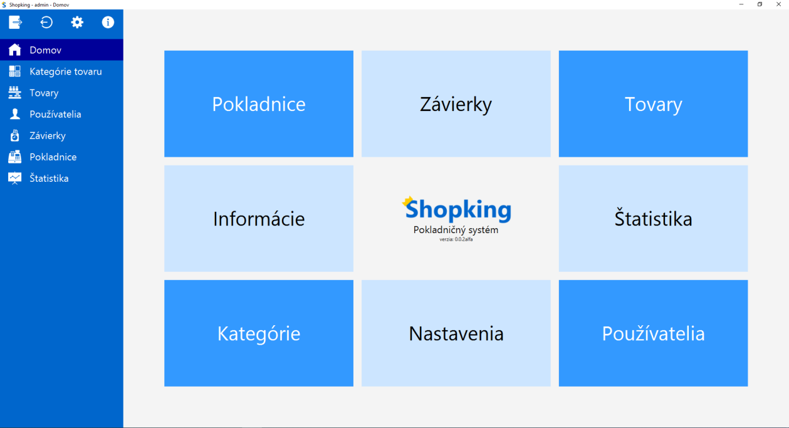
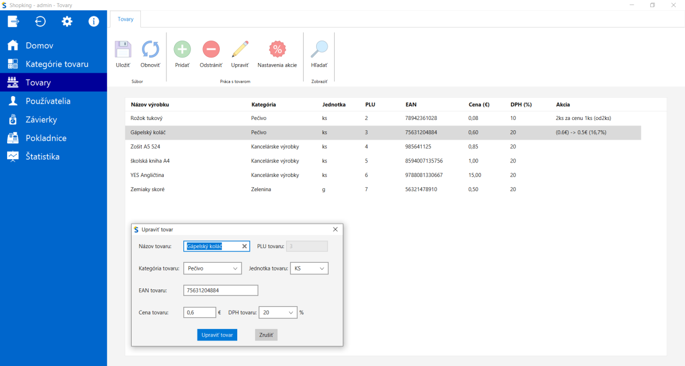
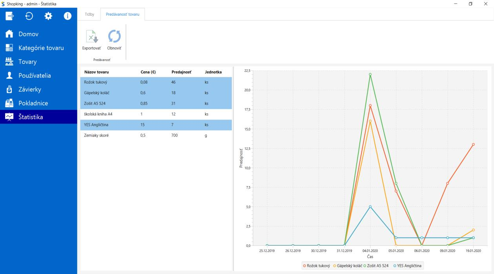
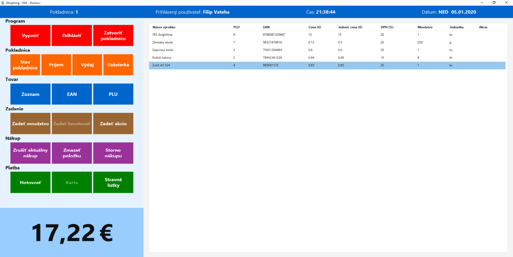

# Shopking
Program Shopking ukážka pokladničného systému pre maloobchodné prevádzky. Bol vyvíjaný cca. od júla 2019 do marca 2020 ako súčasť praktickej časti maturitnej skúšky na Strednej priemyselnej škole elektrotechnickej v Košiciach.

## UPOZORNENIE!!!
Tento program nie je certifikovaný Finančnou správou SR ako oficiálny pokladničný systém kompatibilný s virtuálnou rigistračnou pokladnicou eKasa. Slúži len ako jednoduchá ukažka správy pokladnice malobchodnej prevádzky.

## Ukážky

